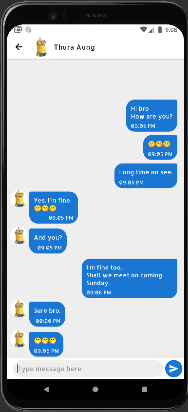

# Chats

### A messaging app using firebase.App users can send messages to each other.

### Libraries used

* [Firebase firestore][0] provides backend services, easy-to-use SDKs, and ready-made UI libraries to authenticate users to your app.  
* [Firebase authentication][1] is a flexible, scalable database for mobile, web, and server development from Firebase and Google Cloud.
* [Firebase cloud messaging][7] is a cross-platform messaging solution that lets you reliably send messages at no cost.
* [Retrofit][4] A type-safe HTTP client for Android.
* [Coil][5] An image loading library for Android backed by Kotlin Coroutines.
* [Live data][2] build data objects that notify views when the underlying database changes.
* [View model][3] store UI-related data that isn't destroyed on app rotations. 
* [View binding][6] is a feature that allows you to more easily write code that interacts with views.

[0]: https://firebase.google.com/docs/firestore
[1]: https://firebase.google.com/docs/auth
[2]: https://developer.android.com/topic/libraries/architecture/livedata
[3]: https://developer.android.com/topic/libraries/architecture/viewmodel
[4]: https://square.github.io/retrofit/
[5]: https://github.com/coil-kt/coil
[6]: https://developer.android.com/topic/libraries/view-binding
[7]: https://firebase.google.com/docs/cloud-messaging
